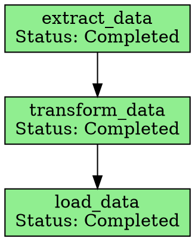

# Dagger: Multi-Paradigm Workflow Orchestration in Rust

[](https://www.rust-lang.org/)
[](https://opensource.org/licenses/MIT)

Dagger is a powerful, flexible Rust library for orchestrating complex workflows using three distinct paradigms: DAG-based execution, sophisticated task management, and event-driven pub/sub systems. Whether you're building data pipelines, AI agent workflows, or distributed processing systems, Dagger provides the tools to model, execute, and monitor your workflows efficiently.

## 🚀 Why Dagger?

### The Problem

Modern applications often require sophisticated workflow orchestration that goes beyond simple sequential execution:

- **Data Pipelines**: Execute dependent operations with proper error handling and retry logic
- **AI Agent Systems**: Coordinate multiple AI agents with complex dependencies and state management
- **Distributed Processing**: Manage tasks across multiple workers with persistence and recovery
- **Event-Driven Architectures**: Build reactive systems with dynamic message routing

Existing solutions often force you into a single paradigm or require complex setup. Dagger gives you three powerful patterns in one cohesive library.

### The Solution

Dagger addresses these challenges by providing:

1. **Multiple Orchestration Paradigms**: Choose the right pattern for your use case
2. **Rust Performance & Safety**: Zero-cost abstractions with memory safety
3. **Built-in Persistence**: Automatic state management and recovery
4. **Rich Visualization**: Generate execution graphs for debugging and monitoring
5. **Flexible Error Handling**: Configurable retry policies and failure strategies

## 📋 Table of Contents

- [🎯 Core Concepts](#-core-concepts)
- [🏗️ Architecture Overview](#️-architecture-overview)
- [⚡ Quick Start](#-quick-start)
- [📊 Orchestration Paradigms](#-orchestration-paradigms)
  - [DAG Flow: YAML-Based Workflows](#dag-flow-yaml-based-workflows)
  - [Task Agent: Sophisticated Task Management](#task-agent-sophisticated-task-management)
  - [Pub/Sub: Event-Driven Communication](#pubsub-event-driven-communication)
- [🔧 Installation](#-installation)
- [💡 Examples](#-examples)
- [📈 Visualization](#-visualization)
- [🎛️ Configuration](#️-configuration)
- [🧰 Advanced Usage](#-advanced-usage)
- [🤝 Contributing](#-contributing)

## 🎯 Core Concepts

### Three Orchestration Paradigms

| Paradigm | Best For | Key Features |
|----------|----------|--------------|
| **DAG Flow** | Predefined workflows, data pipelines | YAML definition, dependency management, static analysis |
| **Task Agent** | Complex agent systems, job management | Persistence, dynamic dependencies, agent assignment |
| **Pub/Sub** | Event-driven systems, reactive workflows | Message routing, dynamic channels, schema validation |

### Key Components

- **Executors**: Core engines that manage workflow execution
- **Actions/Agents**: Individual units of work with defined inputs/outputs
- **Cache**: Shared storage for intermediate results and state
- **Registry**: Central registry for actions and agents
- **Visualization**: DOT graph generation for debugging and monitoring

## 🏗️ Architecture Overview

```
┌─────────────────────────────────────────────────────────────┐
│                        Dagger Core                         │
├─────────────────────────────────────────────────────────────┤
│  ┌─────────────┐  ┌─────────────┐  ┌─────────────┐        │
│  │ DAG Flow    │  │ Task Agent  │  │ Pub/Sub     │        │
│  │ Executor    │  │ Manager     │  │ Executor    │        │
│  └─────────────┘  └─────────────┘  └─────────────┘        │
├─────────────────────────────────────────────────────────────┤
│  ┌─────────────┐  ┌─────────────┐  ┌─────────────┐        │
│  │   Cache     │  │  Registry   │  │  Macros     │        │
│  │  System     │  │  System     │  │  System     │        │
│  └─────────────┘  └─────────────┘  └─────────────┘        │
├─────────────────────────────────────────────────────────────┤
│  ┌─────────────┐  ┌─────────────┐  ┌─────────────┐        │
│  │   Error     │  │   Memory    │  │ Resource    │        │
│  │ Handling    │  │ Management  │  │ Tracking    │        │
│  └─────────────┘  └─────────────┘  └─────────────┘        │
└─────────────────────────────────────────────────────────────┘
```

## ⚡ Quick Start

### Installation

Add Dagger to your `Cargo.toml`:

```toml
[dependencies]
dagger = { path = "path/to/dagger" }  # Replace with actual version when published
tokio = { version = "1.0", features = ["full"] }
serde_json = "1.0"
anyhow = "1.0"
```

### Simple DAG Example

```rust
use dagger::*;
use anyhow::Result;
use std::collections::HashMap;
use std::sync::{Arc, RwLock};

// Define an action
async fn add_numbers(_executor: &mut DagExecutor, node: &Node, cache: &Cache) -> Result<()> {
    let num1: f64 = parse_input_from_name(cache, "num1".to_string(), &node.inputs)?;
    let num2: f64 = parse_input_from_name(cache, "num2".to_string(), &node.inputs)?;
    let sum = num1 + num2;
    insert_value(cache, &node.id, &node.outputs[0].name, sum)?;
    Ok(())
}

#[tokio::main]
async fn main() -> Result<()> {
    // Create executor
    let registry = Arc::new(RwLock::new(HashMap::new()));
    let mut executor = DagExecutor::new(None, registry, "dagger_db")?;
    
    // Register action
    register_action!(executor, "add_numbers", add_numbers);
    
    // Load YAML workflow
    executor.load_yaml_file("workflow.yaml")?;
    
    // Execute
    let cache = Cache::new(HashMap::new());
    insert_value(&cache, "inputs", "num1", 10.0)?;
    insert_value(&cache, "inputs", "num2", 20.0)?;
    
    let (cancel_tx, cancel_rx) = tokio::sync::oneshot::channel();
    let report = executor.execute_dag(
        WorkflowSpec::Static { name: "my_workflow".to_string() },
        &cache,
        cancel_rx
    ).await?;
    
    println!("Result: {:?}", report);
    Ok(())
}
```

### Simple Task Agent Example

```rust
use dagger::*;
use serde_json::json;

#[task_agent(
    name = "calculator",
    description = "Performs basic arithmetic",
    input_schema = r#"{"type": "object", "properties": {"a": {"type": "number"}, "b": {"type": "number"}, "op": {"type": "string"}}}"#,
    output_schema = r#"{"type": "object", "properties": {"result": {"type": "number"}}}"#
)]
async fn calculator(
    input: serde_json::Value,
    task_id: &str,
    job_id: &str,
    task_manager: &TaskManager,
) -> Result<serde_json::Value, String> {
    let a = input["a"].as_f64().unwrap_or(0.0);
    let b = input["b"].as_f64().unwrap_or(0.0);
    let op = input["op"].as_str().unwrap_or("add");
    
    let result = match op {
        "add" => a + b,
        "sub" => a - b,
        "mul" => a * b,
        "div" => if b != 0.0 { a / b } else { return Err("Division by zero".to_string()); },
        _ => return Err("Unknown operation".to_string()),
    };
    
    Ok(json!({"result": result}))
}

#[tokio::main]
async fn main() -> Result<(), Box<dyn std::error::Error>> {
    let cache = Cache::new();
    let agent_registry = TaskAgentRegistry::new();
    let task_manager = TaskManager::new(
        Duration::from_secs(30),
        StallAction::NotifyPlanningAgent,
        cache,
        agent_registry,
        None,
    );
    
    // Create and execute tasks...
    Ok(())
}
```

## 📊 Orchestration Paradigms

### DAG Flow: YAML-Based Workflows

**Best for**: Predefined workflows, data pipelines, ETL processes

DAG Flow allows you to define workflows in YAML with explicit dependencies and execute them with sophisticated error handling, retries, and caching.

#### Key Features:
- 📝 **YAML Definition**: Human-readable workflow specifications
- 🔄 **Dependency Management**: Automatic dependency resolution
- 🔁 **Retry Logic**: Configurable retry policies per node
- ⏱️ **Timeouts**: Per-node and global timeout handling
- 📊 **Static Analysis**: Validate workflows before execution

#### YAML Workflow Example:

```yaml
name: data_pipeline
description: Process customer data
nodes:
  - id: extract_data
    action: extract_customers
    inputs:
      - name: source_db
        reference: inputs.database_url
    outputs:
      - name: raw_data
    timeout: 300
    try_count: 3

  - id: transform_data
    dependencies: [extract_data]
    action: clean_and_transform
    inputs:
      - name: data
        reference: extract_data.raw_data
    outputs:
      - name: clean_data
    timeout: 600

  - id: load_data
    dependencies: [transform_data]
    action: load_to_warehouse
    inputs:
      - name: data
        reference: transform_data.clean_data
      - name: target_table
        reference: inputs.target_table
    outputs:
      - name: loaded_count
```

#### Rust Implementation:

```rust
// Define actions for each step
async fn extract_customers(_executor: &mut DagExecutor, node: &Node, cache: &Cache) -> Result<()> {
    let db_url: String = parse_input_from_name(cache, "source_db".to_string(), &node.inputs)?;
    // Extract logic here
    let data = vec!["customer1", "customer2"]; // Simplified
    insert_value(cache, &node.id, "raw_data", data)?;
    Ok(())
}

async fn clean_and_transform(_executor: &mut DagExecutor, node: &Node, cache: &Cache) -> Result<()> {
    let raw_data: Vec<String> = parse_input_from_name(cache, "data".to_string(), &node.inputs)?;
    // Transform logic here
    let clean_data: Vec<String> = raw_data.iter().map(|s| s.to_uppercase()).collect();
    insert_value(cache, &node.id, "clean_data", clean_data)?;
    Ok(())
}

async fn load_to_warehouse(_executor: &mut DagExecutor, node: &Node, cache: &Cache) -> Result<()> {
    let data: Vec<String> = parse_input_from_name(cache, "data".to_string(), &node.inputs)?;
    let table: String = parse_input_from_name(cache, "target_table".to_string(), &node.inputs)?;
    // Load logic here
    insert_value(cache, &node.id, "loaded_count", data.len())?;
    Ok(())
}

#[tokio::main]
async fn main() -> Result<()> {
    let registry = Arc::new(RwLock::new(HashMap::new()));
    let mut executor = DagExecutor::new(None, registry, "pipeline_db")?;
    
    // Register all actions
    register_action!(executor, "extract_customers", extract_customers);
    register_action!(executor, "clean_and_transform", clean_and_transform);
    register_action!(executor, "load_to_warehouse", load_to_warehouse);
    
    // Load and execute workflow
    executor.load_yaml_file("data_pipeline.yaml")?;
    
    let cache = Cache::new(HashMap::new());
    insert_value(&cache, "inputs", "database_url", "postgresql://...")?;
    insert_value(&cache, "inputs", "target_table", "customers_clean")?;
    
    let (_, cancel_rx) = tokio::sync::oneshot::channel();
    let report = executor.execute_dag(
        WorkflowSpec::Static { name: "data_pipeline".to_string() },
        &cache,
        cancel_rx
    ).await?;
    
    println!("Pipeline completed: {:?}", report);
    Ok(())
}
```

### Task Agent: Sophisticated Task Management

**Best for**: AI agent systems, complex job orchestration, distributed task processing

The Task Agent system provides enterprise-grade task management with persistence, dynamic dependencies, and sophisticated state management.

#### Key Features:
- 💾 **Persistence**: Jobs and tasks survive process restarts
- 🔗 **Dynamic Dependencies**: Tasks can create new dependencies at runtime
- 👥 **Agent Assignment**: Tasks assigned to specific agent types
- 🔄 **Recovery**: Automatic retry and failure handling
- 📊 **State Tracking**: Comprehensive task lifecycle management

#### Dynamic Dependencies Example:

One of the most powerful features is the ability for agents to dynamically create new tasks as dependencies:

```rust
#[task_agent(
    name = "research_agent",
    description = "Conducts research and requests additional data as needed",
    input_schema = r#"{"type": "object", "properties": {"topic": {"type": "string"}}}"#,
    output_schema = r#"{"type": "object", "properties": {"report": {"type": "string"}}}"#
)]
async fn research_agent(
    input: serde_json::Value,
    task_id: &str,
    job_id: &str,
    task_manager: &TaskManager,
) -> Result<serde_json::Value, String> {
    let topic = input["topic"].as_str().unwrap_or("general");
    
    // Check if this is a retry after dependencies were added
    let task = task_manager.get_task_by_id(task_id)
        .ok_or("Task not found")?;
    
    if !task.dependencies.is_empty() {
        // This is a retry - use dependency outputs
        let dependency_outputs = task_manager.get_dependency_outputs(task_id)
            .map_err(|e| format!("Failed to get dependency outputs: {}", e))?;
        
        let mut research_data = vec![format!("Initial research on {}", topic)];
        for output in dependency_outputs {
            if let Some(data) = output.get("data") {
                research_data.push(data.as_str().unwrap_or("").to_string());
            }
        }
        
        let report = format!("Comprehensive report on {}: {}", topic, research_data.join(", "));
        return Ok(json!({"report": report}));
    }
    
    // First execution - check if we need more data
    if topic.contains("advanced") {
        // Create a data gathering task
        let data_task_id = task_manager.add_task_with_type(
            job_id.to_string(),
            format!("Gather additional data for {}", topic),
            "data_gatherer".to_string(),
            vec![],
            json!({"query": format!("detailed {} information", topic)}),
            Some(task_id.to_string()),
            None,
            TaskType::Task,
            None,
            0,
            None,
            0,
        ).map_err(|e| format!("Failed to create dependency: {}", e))?;
        
        // Add as dependency and block current task
        task_manager.add_dependency(task_id, &data_task_id)
            .map_err(|e| format!("Failed to add dependency: {}", e))?;
        
        task_manager.update_task_status(task_id, TaskStatus::Blocked)
            .map_err(|e| format!("Failed to update status: {}", e))?;
        
        return Err("needs_more_info".to_string());
    }
    
    // Simple research without additional data
    let report = format!("Basic report on {}", topic);
    Ok(json!({"report": report}))
}
```

#### Multi-Agent Workflow:

```rust
#[tokio::main]
async fn main() -> Result<(), Box<dyn std::error::Error>> {
    let cache = Cache::new();
    let agent_registry = TaskAgentRegistry::new();
    
    // Register multiple agent types
    agent_registry.register("research_agent", Box::new(ResearchAgent::new()))?;
    agent_registry.register("data_gatherer", Box::new(DataGatherer::new()))?;
    agent_registry.register("report_writer", Box::new(ReportWriter::new()))?;
    
    let task_manager = TaskManager::new(
        Duration::from_secs(60),
        StallAction::NotifyPlanningAgent,
        cache,
        agent_registry,
        Some(PathBuf::from("research_job_db")),
    );
    
    // Create a complex research job
    let job_id = "research_job_001".to_string();
    
    // Create initial research task
    let research_task_id = task_manager.add_objective(
        job_id.clone(),
        "Research advanced AI techniques".to_string(),
        "research_agent".to_string(),
        json!({"topic": "advanced machine learning"}),
    )?;
    
    // Create final report task that depends on research
    let report_task_id = task_manager.add_task_with_type(
        job_id.clone(),
        "Write final report".to_string(),
        "report_writer".to_string(),
        vec![research_task_id.clone()],
        json!({"format": "executive_summary"}),
        None,
        None,
        TaskType::Task,
        None,
        0,
        None,
        0,
    )?;
    
    // Start the job
    let job_handle = task_manager.start_job(
        job_id.clone(),
        vec![],
        Some(vec!["research_agent".to_string(), "data_gatherer".to_string(), "report_writer".to_string()]),
        None,
    )?;
    
    // Monitor progress
    loop {
        match job_handle.get_status().await {
            JobStatus::Running => {
                tokio::time::sleep(Duration::from_secs(1)).await;
            }
            JobStatus::Completed(success) => {
                println!("Research job completed successfully: {}", success);
                break;
            }
            JobStatus::Cancelled => {
                println!("Research job was cancelled");
                break;
            }
        }
    }
    
    // Generate execution graph
    let dot_graph = task_manager.get_dot_graph(Some(&job_id))?;
    std::fs::write("research_execution.dot", dot_graph)?;
    
    Ok(())
}
```

### Pub/Sub: Event-Driven Communication

**Best for**: Reactive systems, event-driven architectures, real-time processing

The Pub/Sub system enables building event-driven workflows where agents communicate through messages and channels.

#### Key Features:
- 📡 **Dynamic Channels**: Create channels on-demand
- 🔄 **Message Routing**: Intelligent message distribution
- 📋 **Schema Validation**: Ensure message format compliance
- 🏃 **Async Processing**: Non-blocking message handling

> **Note**: The Pub/Sub system is currently under development. Basic functionality is available but may have limitations.

## 📈 Visualization

Dagger provides powerful visualization capabilities to help you understand and debug your workflows:

### DAG Flow Visualization

```rust
// Generate DOT graph for a DAG execution
let dot_output = executor.serialize_tree_to_dot("workflow_name")?;
std::fs::write("workflow.dot", dot_output)?;

// Convert to PNG using Graphviz
// dot -Tpng workflow.dot -o workflow.png
```

### Task Agent Execution Graph

```rust
// Generate execution graph for a job
let dot_graph = task_manager.get_dot_graph(Some("job_id"))?;
std::fs::write("execution.dot", dot_graph)?;
```

### Example Visualization Output



## 🔧 Installation

### Prerequisites

- Rust 1.70 or higher
- Tokio async runtime

### Adding to Your Project

```toml
[dependencies]
dagger = { path = "path/to/dagger" }  # Replace with crate version when published
tokio = { version = "1.0", features = ["full"] }
serde = { version = "1.0", features = ["derive"] }
serde_json = "1.0"
anyhow = "1.0"
```

### Optional Dependencies

For enhanced functionality:

```toml
[dependencies]
# For macro support
dagger-macros = { path = "path/to/dagger-macros" }

# For visualization
# Note: Requires Graphviz installation
graphviz = "0.8"

# For advanced logging
tracing = "0.1"
tracing-subscriber = "0.3"
```

### Building from Source

```bash
git clone <repository-url>
cd dagger
cargo build --release
```

## 💡 Examples

The `examples/` directory contains comprehensive examples for each paradigm:

### Running Examples

```bash
# DAG Flow example
cd examples/dag_flow
cargo run

# Task Agent example
cd examples/agent_simple
cargo run

# Advanced examples
cd examples/deepresearch
cargo run
```

### Example Projects

| Example | Description | Paradigm |
|---------|-------------|----------|
| `dag_flow` | Basic YAML workflow execution | DAG Flow |
| `agent_simple` | Simple agent-driven workflow | DAG Flow |
| `agent_flow` | Dynamic agent orchestration | DAG Flow |
| `deepresearch` | Complex multi-agent research system | Task Agent |
| `taskmanager_deepsearch` | Advanced task management | Task Agent |
| `pubsubagent_basic` | Event-driven communication | Pub/Sub |

## 🎛️ Configuration

### Error Handling Strategies

```rust
// Configure retry policies
let retry_policy = RetryPolicy {
    max_retries: 3,
    base_delay: Duration::from_secs(1),
    max_delay: Duration::from_secs(60),
    backoff: BackoffStrategy::Exponential,
    retry_on: vec!["timeout".to_string(), "resource".to_string()],
};

// Configure error handling
let error_handling = ErrorHandling::ContinueOnError;
```

### Resource Management

```rust
// Configure resource limits
let resource_tracker = ResourceTracker::new();
resource_tracker.set_memory_limit(1_000_000_000); // 1GB
resource_tracker.set_task_limit(100);
```

### Cache Configuration

```rust
// Configure cache settings
let cache_config = CacheConfig {
    max_entries: 10_000,
    max_memory_mb: 256,
    eviction_policy: EvictionPolicy::LRU,
};

let cache = Cache::with_config(cache_config)?;
```

## 🧰 Advanced Usage

### Custom Error Types

```rust
#[derive(Debug, thiserror::Error)]
pub enum MyWorkflowError {
    #[error("Data validation failed: {0}")]
    ValidationError(String),
    #[error("External service unavailable")]
    ServiceUnavailable,
    #[error("Processing timeout")]
    Timeout,
}

// Convert to DaggerError
impl From<MyWorkflowError> for DaggerError {
    fn from(err: MyWorkflowError) -> Self {
        DaggerError::ExecutionError(err.to_string())
    }
}
```

### Custom Agents with State

```rust
pub struct StatefulAgent {
    state: Arc<RwLock<HashMap<String, Value>>>,
}

#[task_agent(
    name = "stateful_processor",
    description = "Agent that maintains state between executions"
)]
impl StatefulAgent {
    async fn execute(&self, input: Value, task_id: &str, job_id: &str) -> Result<Value, String> {
        let mut state = self.state.write().unwrap();
        
        // Update state based on input
        state.insert(task_id.to_string(), input.clone());
        
        // Process based on accumulated state
        let result = self.process_with_state(&state, &input)?;
        
        Ok(result)
    }
}
```

### Integration with External Systems

```rust
// Database integration
async fn database_action(_executor: &mut DagExecutor, node: &Node, cache: &Cache) -> Result<()> {
    let query: String = parse_input_from_name(cache, "query", &node.inputs)?;
    
    // Execute database query
    let pool = sqlx::PgPool::connect("postgresql://...").await?;
    let results = sqlx::query(&query).fetch_all(&pool).await?;
    
    insert_value(cache, &node.id, "results", results)?;
    Ok(())
}

// HTTP API integration
async fn api_action(_executor: &mut DagExecutor, node: &Node, cache: &Cache) -> Result<()> {
    let url: String = parse_input_from_name(cache, "url", &node.inputs)?;
    
    let client = reqwest::Client::new();
    let response = client.get(&url).send().await?;
    let data: Value = response.json().await?;
    
    insert_value(cache, &node.id, "response", data)?;
    Ok(())
}
```

### Performance Monitoring

```rust
use std::time::Instant;

async fn monitored_action(_executor: &mut DagExecutor, node: &Node, cache: &Cache) -> Result<()> {
    let start_time = Instant::now();
    
    // Your action logic here
    let result = perform_computation().await?;
    
    let duration = start_time.elapsed();
    tracing::info!("Action {} completed in {:?}", node.id, duration);
    
    // Store metrics
    insert_value(cache, &node.id, "execution_time_ms", duration.as_millis())?;
    insert_value(cache, &node.id, "result", result)?;
    
    Ok(())
}
```

## 🤝 Contributing

We welcome contributions! Here's how to get started:

### Development Setup

```bash
# Clone the repository
git clone <repository-url>
cd dagger

# Install dependencies
cargo build

# Run tests
cargo test

# Run examples
cd examples/dag_flow
cargo run
```

### Code Style

- Follow Rust standard formatting (`cargo fmt`)
- Ensure all tests pass (`cargo test`)
- Add documentation for public APIs
- Include examples for new features

### Pull Request Process

1. Fork the repository
2. Create a feature branch
3. Make your changes
4. Add tests and documentation
5. Submit a pull request

### Reporting Issues

Please use the GitHub issue tracker to report bugs or request features. Include:

- Rust version
- Dagger version
- Minimal reproduction case
- Expected vs actual behavior

## 📚 Additional Resources

### API Documentation

Generate local documentation:

```bash
cargo doc --open
```

### Performance Benchmarks

Run performance benchmarks:

```bash
cargo bench
```

### Architecture Deep Dive

For detailed architecture information, see:
- `ARCHITECTURE.md` - System design and patterns
- `MIGRATION_SUMMARY.md` - Recent changes and improvements
- `examples/` - Comprehensive examples

## 📄 License

This project is licensed under the MIT License - see the [LICENSE](LICENSE) file for details.

---

Built with ❤️ in Rust. For questions or support, please open an issue on GitHub.