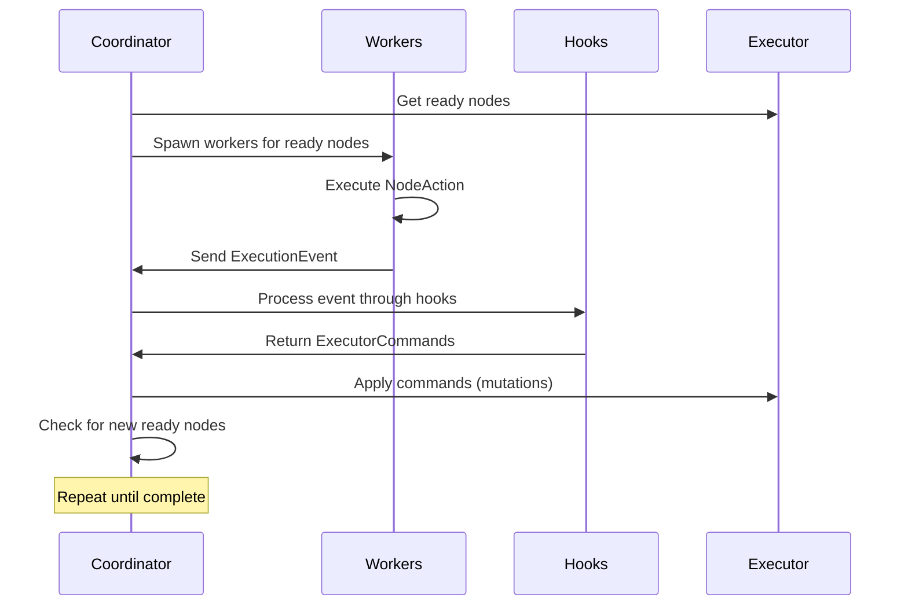

# DAG Flow Architecture

## Overview

DAG Flow is Dagger's directed acyclic graph execution engine, now featuring a **coordinator-based parallel execution system** that eliminates borrow checker issues while maintaining high parallelism and enabling dynamic graph growth.

## Core Architecture Principles

1. **Separation of Concerns**: Compute (workers) vs Control (coordinator) vs Policy (hooks)
2. **Message-Passing**: All communication via channels, no shared mutable state
3. **Single Mutation Point**: Only the Coordinator has `&mut DagExecutor`
4. **Pure Computation**: Node actions are compute-only, no direct state mutation
5. **Dynamic Growth**: Hooks can add nodes via commands during execution

## System Architecture

```
┌─────────────────────────────────────────────────────────────────┐
│                     DAG Flow System (NEW)                       │
├─────────────────────────────────────────────────────────────────┤
│                                                                 │
│  ┌──────────────────────────────────────────────────────────┐  │
│  │                      COORDINATOR                          │  │
│  │  (Only component with &mut DagExecutor)                   │  │
│  │                                                           │  │
│  │  ┌─────────────┐     ┌──────────────┐                    │  │
│  │  │   Command   │────▶│  Apply       │                    │  │
│  │  │   Channel   │     │  Mutations   │                    │  │
│  │  └─────────────┘     └──────────────┘                    │  │
│  │         ▲                    │                            │  │
│  │         │                    ▼                            │  │
│  │  ┌─────────────┐     ┌──────────────┐                    │  │
│  │  │    Event    │◀────│   Schedule   │                    │  │
│  │  │   Channel   │     │   Workers    │                    │  │
│  │  └─────────────┘     └──────────────┘                    │  │
│  └──────────────────────────────────────────────────────────┘  │
│         ▲                                      │                │
│         │                                      ▼                │
│  ┌──────────────┐                    ┌──────────────┐          │
│  │              │                    │              │          │
│  │  EVENT HOOKS │                    │   WORKERS    │          │
│  │              │                    │              │          │
│  │ ┌──────────┐ │                    │ ┌──────────┐ │          │
│  │ │ Planner  │ │                    │ │  Node 1  │ │          │
│  │ └──────────┘ │                    │ └──────────┘ │          │
│  │ ┌──────────┐ │      Events        │ ┌──────────┐ │          │
│  │ │   HITL   │ │◀───────────────────│ │  Node 2  │ │          │
│  │ └──────────┘ │                    │ └──────────┘ │          │
│  │ ┌──────────┐ │                    │ ┌──────────┐ │          │
│  │ │  Budget  │ │      Commands      │ │  Node N  │ │          │
│  │ └──────────┘ │────────────────────▶ └──────────┘ │          │
│  │              │                    │              │          │
│  └──────────────┘                    └──────────────┘          │
│                                                                 │
│  ┌──────────────────────────────────────────────────────────┐  │
│  │                    Cache Layer (DashMap)                  │  │
│  └──────────────────────────────────────────────────────────┘  │
│                                                                 │
│  ┌──────────────────────────────────────────────────────────┐  │
│  │           Persistence Layer (SQLite Database)             │  │
│  └──────────────────────────────────────────────────────────┘  │
└─────────────────────────────────────────────────────────────────┘
```

## Core Components

### 1. Coordinator (`src/coord/coordinator.rs`)

The heart of the system that orchestrates all execution:

```rust
pub struct Coordinator {
    evt_tx: mpsc::Sender<ExecutionEvent>,    // Receive events from workers
    evt_rx: mpsc::Receiver<ExecutionEvent>,
    cmd_tx: mpsc::Sender<ExecutorCommand>,   // Send commands to apply
    cmd_rx: mpsc::Receiver<ExecutorCommand>,
    hooks: Vec<Arc<dyn EventHook>>,          // Process events into commands
}

impl Coordinator {
    pub async fn run_parallel(
        mut self,
        exec: &mut DagExecutor,  // ONLY place with mutable access
        cache: &Cache,
        dag_name: &str,
        run_id: &str,
        cancel_rx: oneshot::Receiver<()>,
    ) -> Result<()>
}
```

**Key Responsibilities:**
- Owns `&mut DagExecutor` exclusively
- Schedules ready nodes for execution
- Processes events from workers through hooks
- Applies commands to mutate the DAG
- Manages backpressure and graceful shutdown

### 2. NodeAction (`src/coord/action.rs`)

Pure computation nodes with no state mutation:

```rust
pub struct NodeCtx {
    pub dag_name: String,
    pub node_id: String,
    pub inputs: Value,                     // Node inputs
    pub cache: Cache,                      // Thread-safe cache
    pub app_data: Option<Arc<dyn Any>>,    // Application-specific data
}

#[async_trait]
pub trait NodeAction: Send + Sync {
    fn name(&self) -> &str;
    async fn execute(&self, ctx: &NodeCtx) -> Result<NodeOutput>;
}

pub struct NodeOutput {
    pub outputs: Option<Value>,   // Data to store in cache
    pub success: bool,
    pub metadata: Option<Value>,
}
```

**Key Features:**
- No access to `&mut DagExecutor`
- Pure computation only
- Returns outputs via `NodeOutput`
- Thread-safe execution

### 3. EventHook (`src/coord/hooks.rs`)

Policy layer that processes events into commands:

```rust
pub struct HookContext {
    pub run_id: String,
    pub dag_name: String,
    pub app_data: Option<Arc<dyn Any>>,  // For application-specific data
}

#[async_trait]
pub trait EventHook: Send + Sync {
    async fn handle(&self, ctx: &HookContext, event: &ExecutionEvent) -> Vec<ExecutorCommand>;
    async fn on_start(&self, ctx: &HookContext) -> Vec<ExecutorCommand>;
    async fn on_complete(&self, ctx: &HookContext, success: bool) -> Vec<ExecutorCommand>;
}
```

**Use Cases:**
- **Planner**: Add tool/continuation/LLM nodes based on outputs
- **HITL**: Pause/resume based on human input requirements
- **Budget**: Cancel if cost exceeds limits
- **Monitoring**: Track execution metrics

### 4. Events and Commands (`src/coord/types.rs`)

Communication protocol between components:

```rust
// Events from workers to coordinator
pub enum ExecutionEvent {
    NodeStarted { node: NodeRef },
    NodeCompleted { node: NodeRef, outcome: NodeOutcome },
    NodeFailed { node: NodeRef, error: String },
}

// Commands from hooks to coordinator
pub enum ExecutorCommand {
    AddNode { dag_name: String, spec: NodeSpec },
    AddNodes { dag_name: String, specs: Vec<NodeSpec> },
    SetNodeInputs { dag_name: String, node_id: String, inputs: Value },
    PauseBranch { branch_id: String, reason: Option<String> },
    ResumeBranch { branch_id: String },
    CancelBranch { branch_id: String },
    EmitEvent { event: RuntimeEventV2 },
}

// Node specification for dynamic addition
pub struct NodeSpec {
    pub id: Option<String>,        // Generated if None
    pub action: String,
    pub deps: Vec<String>,
    pub inputs: Value,
    pub timeout: Option<u64>,
    pub try_count: Option<u32>,
}
```

### 5. ActionRegistry (`src/coord/registry.rs`)

Registry for node actions:

```rust
pub struct ActionRegistry {
    actions: Arc<RwLock<HashMap<String, Arc<dyn NodeAction>>>>,
}

impl ActionRegistry {
    pub fn register(&self, action: Arc<dyn NodeAction>);
    pub fn get(&self, name: &str) -> Option<Arc<dyn NodeAction>>;
}
```

## Execution Flow

### 1. Initialization
```rust
// Register actions
let registry = ActionRegistry::new();
registry.register(Arc::new(MyAction));

// Create hooks
let hooks = vec![
    Arc::new(PlannerHook),
    Arc::new(MonitorHook),
];

// Create coordinator
let coordinator = Coordinator::new(hooks, 100, 100);
```

### 2. Execution Loop



### 3. Worker Execution
Each worker:
1. Acquires semaphore permit (concurrency control)
2. Sends `NodeStarted` event
3. Executes `NodeAction::execute()`
4. Sends `NodeCompleted` or `NodeFailed` event
5. Releases permit

### 4. Command Processing
Only the Coordinator's `apply_command()` function mutates state:
```rust
fn apply_command(exec: &mut DagExecutor, dag_name: &str, cmd: ExecutorCommand) -> Result<()> {
    match cmd {
        AddNode { spec, .. } => exec.add_node(...),
        SetNodeInputs { inputs, .. } => exec.set_node_inputs_json(...),
        PauseBranch { .. } => exec.pause_branch(...),
        // ... etc
    }
}
```

## Cache System

The cache remains thread-safe and accessible to all components:

```rust
pub struct Cache {
    pub data: Arc<DashMap<String, DashMap<String, SerializableData>>>,
}
```

**Operations:**
- Workers write outputs via cache
- Hooks read cache to make decisions
- Thread-safe via `DashMap`
- No synchronization required

## Benefits of This Architecture

### 1. **No Borrow Checker Issues**
- Workers never see `&mut DagExecutor`
- Hooks never see `&mut DagExecutor`
- Only Coordinator mutates, and only at safe points

### 2. **True Parallelism**
- Multiple workers execute concurrently
- Semaphore controls parallelism level
- No lock contention on executor

### 3. **Dynamic Graph Growth**
- Hooks can add nodes during execution
- Atomic batch operations supported
- No race conditions

### 4. **Clean Separation**
- **Workers**: Pure computation
- **Hooks**: Policy and planning
- **Coordinator**: State management
- **Cache**: Data sharing

### 5. **Testability**
- Each component testable in isolation
- Mock channels for testing
- Deterministic command application

## Configuration

```rust
pub struct DagConfig {
    pub max_parallel_nodes: Option<usize>,     // Parallelism level
    pub enable_parallel_execution: bool,       // Use coordinator
    pub timeout_seconds: Option<u64>,          // Overall timeout
    pub max_iterations: Option<u32>,           // Iteration limit
    // ... other options
}
```

## Error Handling

The system handles errors at multiple levels:

1. **Worker Errors**: Sent as `NodeFailed` events
2. **Hook Errors**: Logged but don't stop execution
3. **Command Errors**: Can fail the execution
4. **Channel Errors**: Trigger graceful shutdown

## Performance Considerations

- **Bounded Channels**: Prevent memory overflow
- **Semaphore**: Controls worker concurrency
- **Batch Commands**: `AddNodes` for atomic operations
- **Cache Locality**: DashMap for efficient concurrent access

## Migration from Old System

### Old System (Problem)
```rust
async fn execute_node(
    executor: &mut DagExecutor,  // Mutable borrow required
    node: &Node,
    cache: &Cache,
) -> Result<()>
```

### New System (Solution)
```rust
#[async_trait]
impl NodeAction for MyAction {
    async fn execute(&self, ctx: &NodeCtx) -> Result<NodeOutput> {
        // No executor access, pure computation
    }
}
```

## Example Usage

See `examples/coordinator_demo.rs` for a complete working example that demonstrates:
- Parallel node execution
- Dynamic node addition via hooks
- Clean separation of concerns
- No borrow checker issues

---

*This architecture solves the fundamental Rust borrow checker issues while maintaining high performance and enabling dynamic DAG growth.*