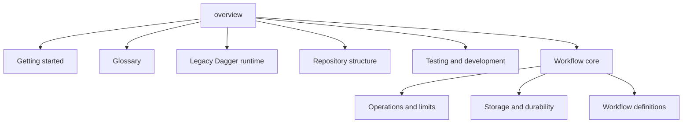

# System overview

Dagger is one Rust workspace. The workspace contains two workflow engines.

The engines have different data models. The engines have different public APIs. They do not call each other.

```text
Host application
    |
    +-- dagger 0.0.1
    |     +-- DAG Flow
    |     +-- Task Agent
    |     +-- Pub/Sub
    |     +-- Work Queue
    |
    +-- dagger-workflow-core 0.1.0
          +-- strict workflow definitions
          +-- bounded scheduler
          +-- memory or SQLite control state
          +-- memory or file-system objects
```

## Select an engine

Use the Dagger runtime when you maintain existing code in `src/`.

Use workflow core when you need these properties:

- A strict JSON or YAML definition.
- A closed set of node types.
- An immutable published revision.
- A tenant and namespace scope on each durable key.
- A budget and explicit run limits.
- Durable retries, approvals, events, and recovery.
- Content-addressed objects.

Do not call workflow core a replacement for the Dagger runtime. The repository does not contain a migration adapter.

## Main boundaries

The host owns process startup, identity, secrets, and deployment policy.

The engine owns workflow state transitions.

The action registry owns executable action implementations.

The control-plane store owns definitions, runs, nodes, attempts, gates, receipts, and events.

The object store owns immutable bytes. A SHA-256 digest identifies these bytes.

## Documentation rules

These pages use Simplified Technical English as a practical writing rule.

- Use short sentences.
- Use active voice.
- Put one action in each instruction.
- Define a term before you use it.
- Use the same word for the same thing.
- State a limit with a number or a source path.
- Separate implemented behavior from planned behavior.

The source code and tests are the final authority for implemented behavior.

<!-- tusker:docs-map:begin -->

<!-- tusker:docs-map:end -->
