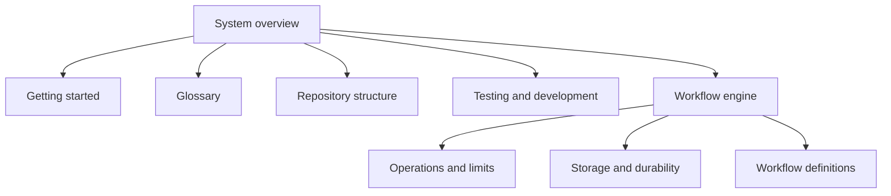

# System overview

Dagger has one workflow engine. One Cargo package owns it.

The package name is `dagger-workflow-core`.

```text
Host application
    |
    +-- WorkflowEngine
          +-- WorkflowStore
          +-- ObjectStore
          +-- ActionRegistry
          +-- published WorkflowRevision
```

## Main flow

1. The host parses a JSON or YAML definition.
2. Dagger validates the fields and graph.
3. The host resolves schemas, artifacts, and action pins.
4. Dagger publishes an immutable revision.
5. The host stores the run input in the object store.
6. The host creates a run with limits and a budget.
7. The engine gets the scheduler claim for one scope.
8. The engine starts and advances the run.
9. Actions return success, retryable failure, or permanent failure.
10. The host reads committed output through `CommittedObjectReader`.

## Boundaries

The host owns process startup, identity, secrets, and deployment policy.

The engine owns workflow state transitions.

The action registry owns executable action implementations and their exact pins.

The control store owns definitions, runs, nodes, attempts, gates, receipts, budgets, and events.

The object store owns immutable bytes. A SHA-256 digest identifies the bytes.

## Documentation rule

The source code is the authority for behavior. Tests are executable evidence for that behavior.

These pages use short sentences, active voice, and one term for one concept. They do not describe planned features.

<!-- tusker:docs-map:begin -->

<!-- tusker:docs-map:end -->
